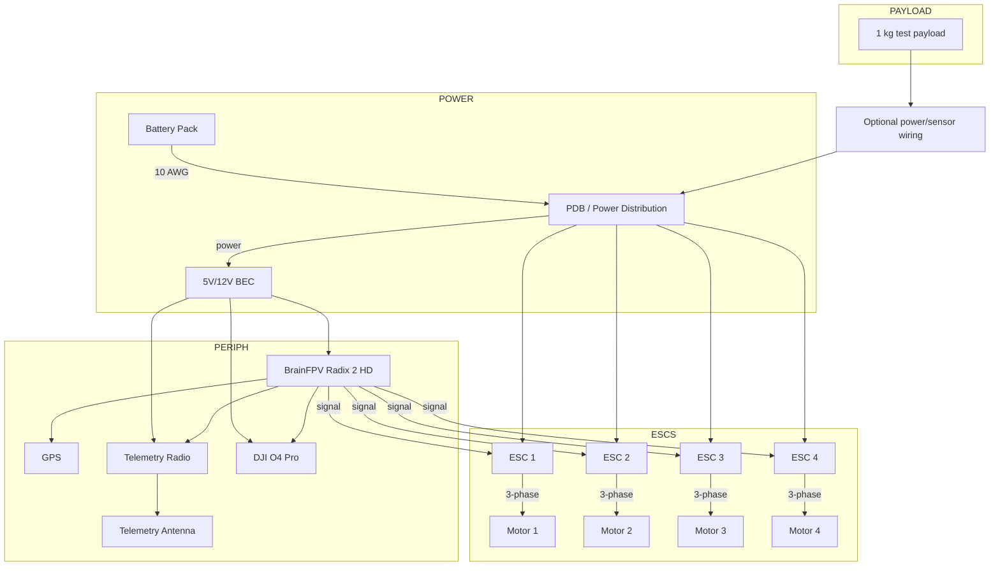

# Beast-Class FPV Drone — Project Log

## Overview

This repository documents my FPV build of a Beast-Class drone. It's a large 13" prop, X-style airframe optimized for speed, maneuverability, and robustness. I built this both to learn and because it's badass.

## Architecture & High-level Block Diagram (Mermaid)

Below is a Mermaid-style block diagram (subgraphs and labeled links) formatted to match Mermaid examples from mermaid.js.org. It shows power, ESCs/motors, the flight controller, peripherals and payload wiring at a high level.

## Parts & Links (as supplied)

| Part | Description / Notes |
|---|---|
| Frame | Team BlackSheep Source-X — modified with custom mounts (motor caps, camera/antenna mounts) |
| Props | ABZEKH Drone Accessories for GEMFAN X Class 1310-3 13 Inch 3-Blade for CW CCW Propeller for FPV Racing for RC Drone |
| Flight Controller | BrainFPV Radix 2 HD — high-performance IMU/gyro |
| ESCs | APD-120F3 series |
| Motors | MAD Polar XC5000 — 380 kV (matched to 13" props) |
| Camera / Video | DJI O4 Pro air-unit — record exact model and mounting notes |
| Batteries | High-discharge Zeee 6S Lipo Battery 10000mAh 22.2V (6S recommended) |
| Telemetry Antenna | RadioMaster RP3 ELRS Receiver 2.4GHz ExpressLRS Nano Receiver FPV RX Module Receiver Long Range Low Latency (antenna orientation matters) |
| GPS | SEQURE M10-25Q FPV GPS Module with QMC5883L Compass Dual Protocol |

## Wiring Notes (summary)

- Power: used 10 AWG for main battery-to-PDB/bulk distribution to ESCs. Use heavy gauge for battery leads and ESC power traces.
- Signal: short, twisted, or shielded wires from FC to ESCs where possible to reduce noise.
- Soldering: I used a soldering iron and fume extraction (fume fan and safety gear). I bought extra metal and nylon screws for mounting and replaced some stock fasteners.
- Protection: added motor-arm caps to protect motor wires and provided strain-relief for ESC-to-motor wires.
- Continuity checks: perform continuity tests with a multimeter for short circuits before connecting the battery.
- Initial power-up: (Do Continuity checks before this step) use a bench power supply set below the maximum battery voltage (below 50 V) to verify powering of FC/ESCs and that nothing overheats.

## Mechanical Integration & CAD

- Motor fitment: TBS frame required custom motor-arm caps to route the MAD motor wires; I designed these in Fusion 360. 
- Camera & antenna mounts: designed custom Fusion 360 parts for the DJI O4 Pro mount and telemetry antenna mount. 

[STL's Here](3D-Prints)

## Soldering & Assembly Steps (detailed)

1. Prepare frame and test-fit mechanical parts.
2. Solder PDB/bulk bus with 10 AWG main leads to ESCs.
3. Solder ESC signal wires to FC and secure with zip-ties.
4. Attach motors to arms; protect and route motor wires under motor arm caps.
5. Install FC and isolate it with foam or soft-mount to reduce vibration.
6. Install telemetry radio, GPS, and antenna; verify orientation and solder connections.
7. Balance props before first flight.
8. Bench continuity test with multimeter; verify no shorts.
9. Power the system from a bench supply (below max battery voltage) and verify current draw and voltage stability.

## Testing & Tuning

- Keep blackbox logging enabled for all test flights.
- Store Betaflight dumps and diffs in as you iterate. I kept multiple dumps across tuning runs (see that folder for prior dumps).
- Thermal tests: (blank) — NOTE: For me — add thermal test results, measured temps, and thermal images here

- GPU/ground station setup: (blank) — NOTE: For me — add notes about OSD/FPV video station and GPU/hardware used for capture and analysis.

## Flight Testing

- Initial hover: tethered low-throttle to verify CG and vibrations.
- Incremental tuning: conservative PID increases, log with blackbox after each change.
- Final tests: document full-power runs, payload runs with 1 kg, and max runtime tests.

## Safety Checklist (short)

- Props removed for bench soldering and configuration.
- Check all screws and mounts.
- Verify failsafe configuration and radio link.
- Verify telemetry and OSD data before climb.

## Materials & Tools Bought

- Soldering iron and stand
- Fume extraction fan and PPE
- Extra metal and nylon screws
- 10 AWG main power wire and appropriate connectors
- XT60/XT90 connectors and adapter for charging (custom charging adapter built)

## Notes on Charging

- I created a custom adapter to charge the batteries using new connectors. Reminder: document adapter wiring and include photos.

## BetaFlight Configs

- [BetaFlight Configs](BetaFlight_Configs)

## Inspiration

- Joshua Bardwell playlist that inspired the project: https://www.youtube.com/watch?v=_6NPi_RuwLo&list=PLwoDb7WF6c8nPdxOfDB6-sHbesoRdWgva